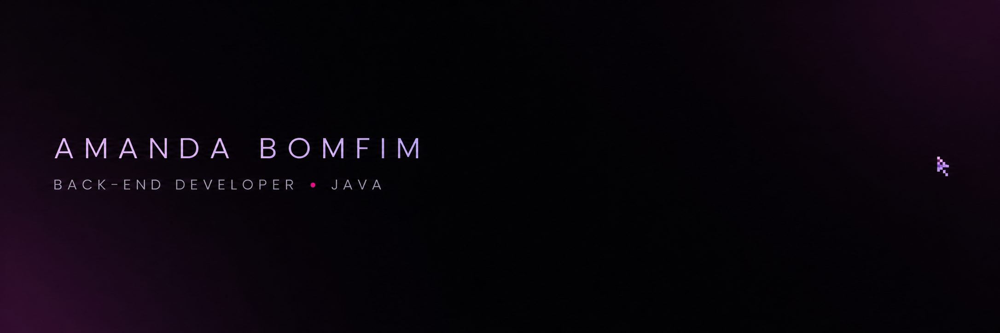

<div align="center">
  
</div>

<br />

<div align="center">
  <a href="https://www.linkedin.com/in/amanda-bomfim-729379222/">
    
  </a>
  <a href="https://github.com/amandabomfim?tab=repositories">
    
  </a>
</div>

## Olá, eu sou a Amanda! 👾

Sou desenvolvedora **Back-end Java**, focada em transformar regras de negócio em APIs organizadas, seguras e fáceis de evoluir.

Minha stack principal é formada por **Java**, **Spring Boot**, **APIs REST**, **Spring Security** e **Swagger/OpenAPI**. Também tenho explorado arquiteturas de microsserviços, BFF e arquitetura hexagonal em projetos práticos.

```java
public class Amanda {
    String role = "Back-end Developer";
    String mainLanguage = "Java";
    String[] currentQuest = {
        "Construir APIs robustas",
        "Escrever código limpo",
        "Evoluir um nível por vez"
    };
}
```

## Tech stack

<div align="center">
  
  
  
  
  
  
</div>

## Projetos em destaque

### 🍽️ [FourKitchen](https://github.com/amandabomfim/FourKitchen)

Plataforma de gerenciamento de restaurantes desenvolvida com **Java**, **Spring Boot**, microsserviços e BFF.

### 🏦 [FourBank](https://github.com/amandabomfim/FourBank)

Aplicação bancária para gerenciamento de contas e transferências, desenvolvida com **Java**, **Spring Boot** e arquitetura hexagonal.

## GitHub stats

<div align="center">
  
  
</div>

## Vamos nos conectar?

Estou sempre aberta a trocar experiências sobre desenvolvimento back-end, Java e o ecossistema Spring.

<div align="center">
  <a href="https://www.linkedin.com/in/amanda-bomfim-729379222/">
    
  </a>
</div>

<br />

<div align="center">
  <sub>✦ Build. Learn. Level up. ✦</sub>
</div>
